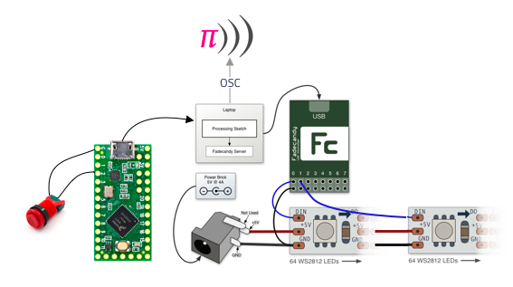

# 1D Neopixel Pong

We heard that hyper casual gaming is the next big thing. What's more hyperly casual than smashing one of those old school arcade buttons? To spice up the oddly nice sensation of those arcade buttons we added some flasy LED effects. And some Sonic Pi noodling of course while we're at it. 


## Running everything pre-built

You will need [Sonic Pi](https://sonic-pi.net/) and [Processing](http://processing.org/).

Clone this repo (and use a flag to get the fadecandy submodules):

```
git clone --recurse-submodules https://github.com/xxx/xxx
```

You will need to:

- Connect power and USB-cables
- Run FadeCandy server for controlling the LEDs
- Run Sonic Pi for sounds
- Run Processing sketch for the actual game

### Connect everything

5V wall-wart for the led strip. Usb to computer for the FadeCandy board and usb to computer for a button if you're using an external button.



### FadeCandy

Open terminal and navigate to this directory. Then run the pre-built fcserver:

```
./bin/fcserver-osx
```

### Sonic Pi

Open `./Sonic Pi/Led pong.rb` on Sonic Pi (you'll need version >3 for OSC) and run it. You won't hear anything untill Sonic Pi receives OSC messages form the game.

### Processing

Open `./bin/application.macosx` or `.bin/application.linux64` depending on your operating system.

## Building things

If the bin-folder doesn't have the appropriate versions for your environment you'll need to build things for your self.

### Processing

Open Led_pong.pde on processing. Press run on select 'File > Export as application' and choose your platform.

### Fadecandy server

(More info [here](https://github.com/scanlime/fadecandy/tree/master/server))

```
cd fadecandy/server
make submodules
make
```

### Sonic Pi

Getting Sonic Pi 3 on ubuntu 18.04:

```
git clone git@github.com:samaaron/sonic-pi.git
cd sonic-pi/app/gui/qt
./build-ubuntu-18-04
```

If I remember correctly I also had to install qjackctl (`sudo apt-get install qjackctl`)